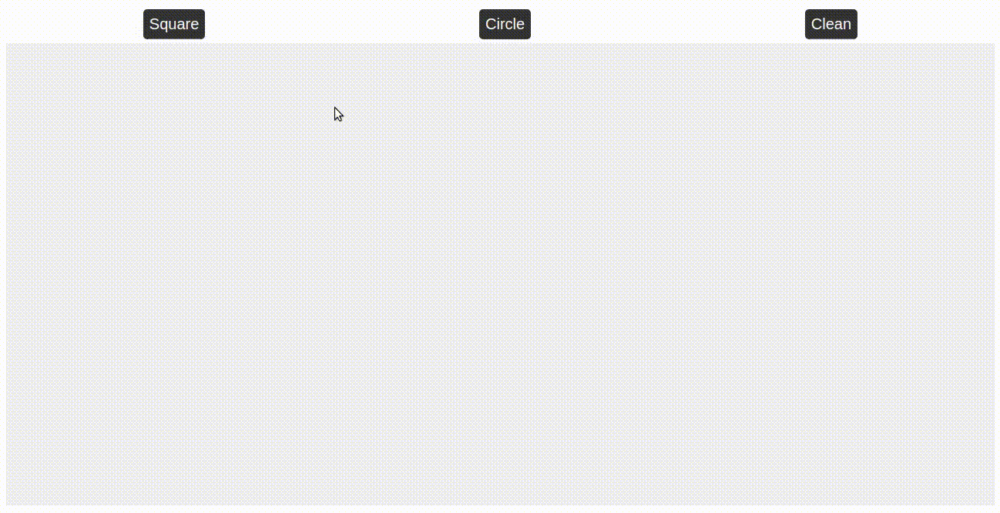

<h1 align="center">
  FUN SQUARES :white_square_button:
</h1>

<h2 align="center">
  Rocketseat JavaScript starter course, second module challenge
</h2>

It may seem like an idiotic project, because it IS an idiotic project! But having fun sometimes with what you do is important, and it also helps you learn JS. :grin: 

 

 
 

  

:runner: Running Locally

It's just a HTML site, so just open the index.html on tem browser. 

Made with ♥ by David Lima [Come and meet me!](https://www.linkedin.com/in/antdavidlima/)